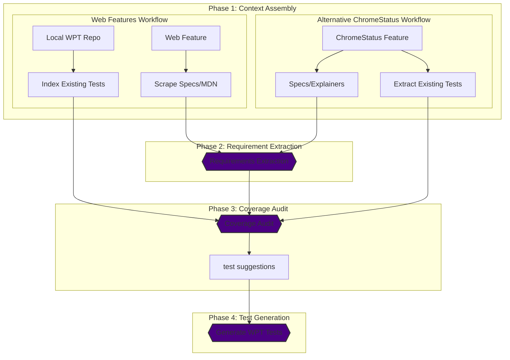

# WPT-Gen: AI-Powered Web Platform Test Generation

[](https://opensource.org/licenses/Apache-2.0)
[](https://www.python.org/downloads/)

**WPT-Gen** is an agentic CLI tool designed to increase browser interoperability by automating the creation of [Web Platform Tests (WPT)](https://web-platform-tests.org/).

To bridge the gap between W3C Specifications and local WPT repositories, WPT-Gen uses Large Language Models (LLMs) to proactively identify testing gaps and generate high-quality, compliant test cases.

## Forging a Unified Web

Browser interoperability is critical for the web. While the W3C and WHATWG write specifications, translating those specs into exhaustive tests is historically manual and error-prone. **WPT-Gen** tackles this challenge by:
- **Reducing Manual Effort:** Automating the tedious process of mapping spec assertions to existing tests.
- **Ensuring High Coverage:** Identifying missing edge cases and suggesting specific test scenarios.
- **Standardizing Compliance:** Generating tests that adhere to strict WPT style guides and directory structures.


## Key Features

*   **Context Assembly:** Automatically resolves Web Feature IDs (via `web-features`) to fetch specification and MDN documentation (if available), using BeautifulSoup and Markdownify to preserve critical code blocks and semantic structure.
*   **Deep Local Analysis:** Scans your local WPT repository using `WEB_FEATURES.yml` metadata to identify existing tests and their dependencies.
*   **Gap Analysis:** Compares technical requirements synthesized from specifications against current test coverage to pinpoint missing assertions.
*   **Test Suggestions:** Brainstorms specific, actionable test scenarios (test suggestions) that address identified gaps.
*   **Automated Generation:** Produces atomic, WPT-compliant HTML and JavaScript test files based on user-approved test suggestions using an autonomous agent powered by `google-adk`.
*   **Multi-Provider Support:** Built-in support for Google Gemini (via `google-genai` and thinking models), OpenAI, and Anthropic models.

**Also for ChromeStatus Integration:** Optionally, you can provide a ChromeStatus feature ID instead of a Web Feature ID. This pulls data directly from the ChromeStatus API (`chromestatus.com`) to drive the requirements extraction and coverage audit phases.

## How it Works

WPT-Gen follows a structured, multi-phase agentic workflow. Each phase is designed to build upon the last, culminating in high-quality, verified test cases.



### Workflow Phases

For an in-depth explanation of the internal logic, inputs, outputs, and LLM integrations for each phase, see the [Workflow Phases Documentation](docs/workflow-phases.md).

1.  **Phase 1: Context Assembly:** Aggregates the "Source of Truth" from external documentation (W3C Specs, MDN) or ChromeStatus feature entries, and identifies existing test coverage in the local WPT repository.
2.  **Phase 2: Requirements Extraction:** Uses an LLM to synthesize specification text into structured, granular technical requirements. Supports parallel and iterative extraction modes for complex specs.
3.  **Phase 3: Coverage Audit:** Performs a delta analysis by comparing the synthesized requirements against the local test suite. This phase outputs an audit worksheet and high-level test suggestions.
4.  **Phase 4: Test Generation:** Translates user-selected test suggestions into functional WPT-compliant code (Testharness, Reftests, or Crashtests) using an autonomous agent powered by `google-adk`, which leverages specialized file-system tools and style guide instructions.

## Prerequisites

*   **Python 3.10+**
*   **Local WPT Repository:** A local checkout of [web-platform-tests/wpt](https://github.com/web-platform-tests/wpt).
*   **API Key:** An API key for a supported LLM (Gemini, OpenAI, or Anthropic).

## Installation

### From PyPI (Recommended)

```bash
pip install wpt-gen
```

### From Source (Development)

```bash
# Clone the repository
git clone https://github.com/GoogleChromeLabs/wpt-gen.git
cd wpt-gen

# Install the package (using a virtual environment is recommended)
python -m venv .venv
source .venv/bin/activate
make install
```

## Configuration

WPT-Gen uses a combination of a YAML configuration file and environment variables.

### 1. Environment Variables
You must export the API key for your chosen provider. These are never stored on disk.

```bash
export GEMINI_API_KEY="your_gemini_api_key"
# OR
export OPENAI_API_KEY="your_openai_api_key"
# OR
export ANTHROPIC_API_KEY="your_anthropic_api_key"
```

### 2. YAML Configuration (`wpt-gen.yml`)
Run `wpt-gen init` to generate a `wpt-gen.yml` configuration file with sensible defaults:

```bash
wpt-gen init --wpt-path /path/to/your/local/wpt
```

This will create a configuration file that looks like this:

```yaml
default_provider: gemini
wpt_path: /path/to/your/local/wpt  # Path to your local WPT checkout

providers:
  gemini:
    default_model: gemini-3.1-pro-preview
    categories:
      lightweight: gemini-3-flash-preview
      reasoning: gemini-3.1-pro-preview
  openai:
    default_model: gpt-5.2-high
    categories:
      lightweight: gpt-5-mini
      reasoning: gpt-5.2-high
  anthropic:
    default_model: claude-opus-4-6
    categories:
      lightweight: claude-sonnet-4-6
      reasoning: claude-opus-4-6


phase_model_mapping:
  requirements_extraction: reasoning
  coverage_audit: reasoning
  generation: lightweight
```

### 3. Managing Configuration via CLI
You can use the built-in `config` command group to view or modify your settings without opening the YAML file manually.

- **View Configuration:**
  ```bash
  wpt-gen config show
  ```
- **Update Configuration:** Use dot-notation to set specific values.
  ```bash
  wpt-gen config set default_provider "openai"
  wpt-gen config set providers.gemini.default_model "gemini-3.1-pro-preview"
  ```

## Usage

The primary interface is the `generate` command, which requires a **Web Feature ID** (as defined in the [web-features](https://github.com/web-platform-dx/web-features) repository).

### Basic Generation

```bash
wpt-gen generate font-family
```

### Common Options

| Option | Shorthand | Description |
| :--- | :--- | :--- |
| `web_feature_id` | (Arg) | **Required.** The ID of the feature (e.g., `font-family`, `popover`). |
| `--provider` | `-p` | Override the default LLM provider (`gemini`, `openai`, `anthropic`). |
| `--wpt-dir` | `-w` | Override the path to the local web-platform-tests repository. |
| `--draft` | | Enable fetching metadata from the draft features directory. |
| `--config` | `-c` | Path to a custom `wpt-gen.yml` file. |

**Note:** You can run `wpt-gen generate --help` to see a full list of all 20+ options (including manual overrides). For more detailed information, see the [CLI Command Reference](docs/cli.md).

### Single Test Generation

The `generate-single` command allows you to bypass the audit phases and directly generate a single WPT test from a behavior description.

```bash
wpt-gen generate-single "description of the behavior to test" --spec-urls https://example.com/spec
```

### Common Options

| Option | Shorthand | Description |
| :--- | :--- | :--- |
| `description` | (Arg) | **Required.** The specific behavior description to test. |
| `--spec-urls` | | Comma-separated list of specification URLs for the feature. **(Required if `--web-feature-id` is not provided)** |
| `--web-feature-id` | `-f` | Optional web feature ID (e.g., `grid`, `popover`). **(Required if `--spec-urls` is not provided)** |
| `--title` | `-t` | Optional title for the test suggestion. |
| `--test-type` | | Optional test type (e.g., `testharness`, `wdspec`). |
| `--provider` | `-p` | Override the default LLM provider. |
| `--wpt-dir` | `-w` | Override the path to the local web-platform-tests repository. |

## ChromeStatus Usage

The `chromestatus` command allows for a more targeted workflow by leveraging ChromeStatus feature entries directly. This is useful for features that may not yet be fully represented in the `web-features` repository.

### Basic Generation

```bash
wpt-gen chromestatus <feature_id>
```

### Common Options

| Option | Shorthand | Description |
| :--- | :--- | :--- |
| `feature_id` | (Arg) | **Required.** The numeric ID of the ChromeStatus feature. |
| `--provider` | `-p` | Override the default LLM provider. |
| `--wpt-dir` | `-w` | Override the path to the local web-platform-tests repository. |
| `--config` | `-c` | Path to a custom `wpt-gen.yml` file. |

**Note:** The `chromestatus` command fetches data from `chromestatus.com/api/v0/features/{feature_id}` and uses the feature's name and summary to drive the requirements extraction and coverage audit phases.

## Other Commands

*   `wpt-gen audit`: Perform a gap analysis and generate coverage blueprints without generating WPT files.
*   `wpt-gen clear-cache`: Clear the existing cached data for wpt-gen.
*   `wpt-gen config`: Manage WPT-Gen configuration.
*   `wpt-gen doctor`: Verify that all system prerequisites are met.
*   `wpt-gen init`: Initialize a new wpt-gen configuration file interactively.
*   `wpt-gen list-models`: Display the configured LLM models for the active provider.
*   `wpt-gen version`: Print the version of wpt-gen.


## Development

### Running Tests
We use `pytest` for unit and integration testing. Run tests easily via:

```bash
make test
```

### Linting & Formatting
We use `ruff` to maintain code quality and `mypy` for type checking. You can run these using `make` commands:

```bash
# Lint and format
make lint-fix

# Type check
make typecheck

# Run all checks (format, lint, typecheck, tests)
make check

# Prepare for PR (runs lint-fix, typecheck, and test)
make presubmit
```

### Release Process

WPT-Gen utilizes a CI/CD pipeline via GitHub Actions. Creating and publishing a new **GitHub Release** (e.g., `v1.0.0`) automatically triggers the `publish.yml` workflow, which securely builds and uploads the package to PyPI. For more details, see the [Contributing Guide](docs/contributing.md).

## AI Assistant Integration

This repository includes a `GEMINI.md` and a suite of AI skills in the `.agents/skills/` directory to help AI assistants (like Gemini Code Assist) better understand the project's architecture, dependencies, and testing standards. You can point your AI assistant to `GEMINI.md` for a comprehensive overview of how to contribute accurately to the codebase.

## License

Apache 2.0. See [LICENSE](LICENSE) for more information.

## Source Code Headers

Every file containing source code must include copyright and license information.

Apache header:

    Copyright 2026 Google LLC

    Licensed under the Apache License, Version 2.0 (the "License");
    you may not use this file except in compliance with the License.
    You may obtain a copy of the License at

        https://www.apache.org/licenses/LICENSE-2.0

    Unless required by applicable law or agreed to in writing, software
    distributed under the License is distributed on an "AS IS" BASIS,
    WITHOUT WARRANTIES OR CONDITIONS OF ANY KIND, either express or implied.
    See the License for the specific language governing permissions and
    limitations under the License.
